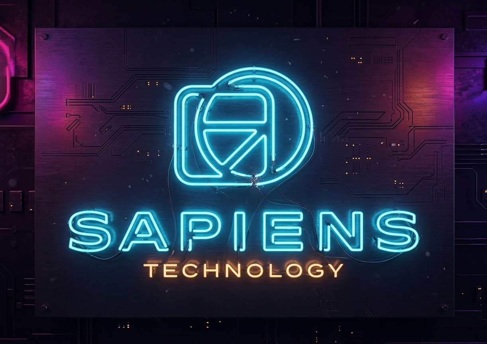

Get to know our company.

# SAPIENS TECHNOLOGY®️

SAPIENS TECHNOLOGY® is not just another technology company, it marks the beginning of a new era in Artificial Intelligence.

In a global landscape dominated by international giants, SAPIENS emerges as a true protagonist: the **first and, as of the date of this publication, the only company in Brazil and across Latin America** to develop a **foundational large language model (LLM/LMM)** with a native focus on **Portuguese and Spanish**. This is not just innovation, it is technological sovereignty.

At the core of this revolution lies Sapiens Chat, a state-of-the-art chatbot built on a multimodal model with an **infinite context window** and an architectural approach that completely breaks away from traditional paradigms. While other artificial intelligences still rely on slow trial-and-error processes, Sapiens introduces a new path: **direct, instantaneous, and mathematically precise learning**, eliminating waste of time, energy, and resources.

This transformation is made possible by a proprietary technological ecosystem, highlighted by the revolutionary **HurNet architecture**, capable of achieving accelerations tens of thousands of times faster than traditional methods, while operating with drastically reduced energy consumption. The result is an AI that is faster, more efficient, and significantly more sustainable.

But SAPIENS goes beyond performance.

With its innovative approach called **Schizophrenic AI**, the company redefines the very concept of decision-making in artificial intelligence. Inspired by the mental processes of geniuses, this technique leverages multiple models working together, generating different internal perspectives before selecting the most refined response. At the center of this process is the **SAPI (Semantic AI with Pretrained Integration)** system, which acts as a “master mind,” semantically evaluating and comparing each possibility to deliver responses with a level of quality superior to traditional models.

The impact is clear: **smarter, more consistent responses that are better aligned with the user’s true intent**.

Furthermore, SAPIENS technology introduces concepts once considered impossible, such as **infinite memory**, enabling AI to understand and retain massive volumes of information without losing context, fundamentally redefining the limits of modern computing.

Driven by a strong commitment to **productivity, performance, and sustainability**, SAPIENS TECHNOLOGY® is not just keeping up with the future, it is building it.

This is a company that does not merely compete with global leaders, but sets a new standard for the entire industry.

**SAPIENS TECHNOLOGY®: beyond standards, beyond limits, beyond time.**

Click [here](https://github.com/sapiens-technology/AboutUs) and learn more.

## Contributing

We do not accept contributions that may result in changing the original code.

Make sure you are using the appropriate version.

## License

This is proprietary repository and its alteration and/or distribution without the developer's authorization is not permitted.

